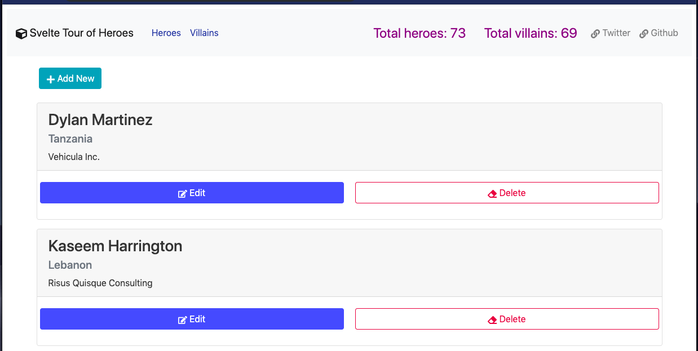

# My version of Tour of Heroes app using Svelte and its own store for State Management API

### Features

Svelte CRUD, animation, HTTP request (using axios), navigation params, 2 stores, computed (derived) values.

### To run the project after cloning

Create or go to your demo directory then run the following in the terminal or cmd.

```sh
$ git clone https://github.com/webmasterdevlin/heroes-svelte.git
$ cd heroes-svelte
$ npm install
$ npm run serve
```

The Svelte app and the fake web service will run concurrently.


